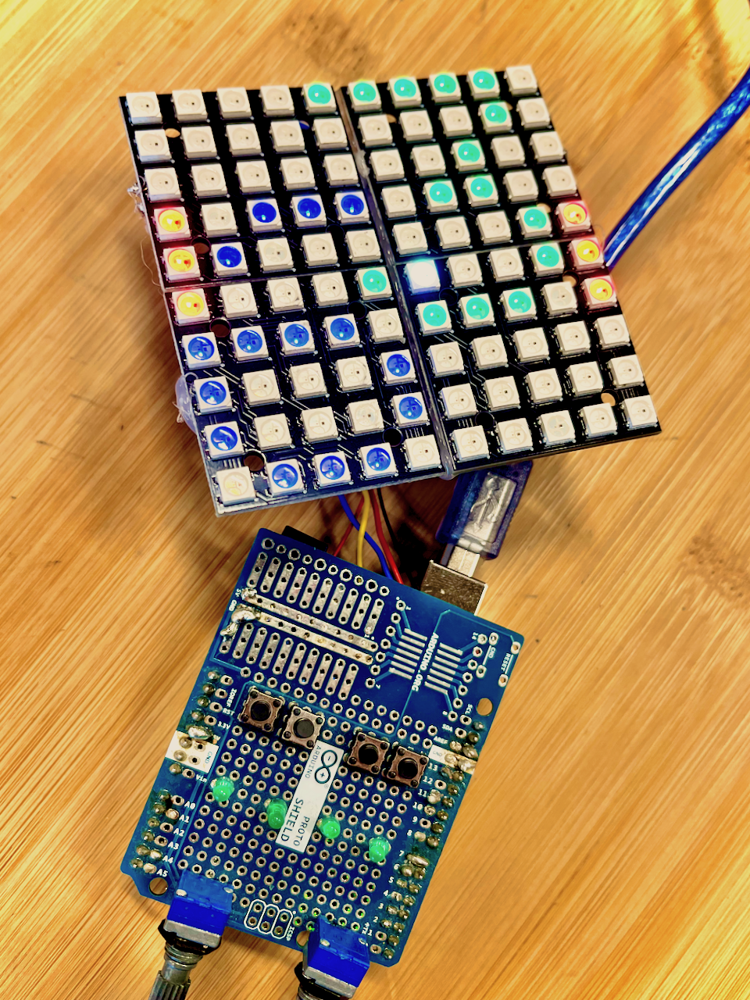

**A project for the workshop Prototyping the Future: Embedded Programming @ Roskilde University spring 2024**

*A simple handheld console that I would let my son Vincent play. Without any distractions but a bunch of abstractions to strengthen his imagination with a emphasis on experimentation.*

Examples of games you can play with a 100 pixel "screen".

**THE CONCEPT**
- A programmable console for Vincent
    - Board
        - Arduino Uno
    - Outputs
        - 10*10 LED RGB matrix instead of a screen
        - Simple piezo buzzer as a speaker
        - 4 Status LEDs
    - Inputs
        - 2 Rotary encoders
        - 4 Digital buttons
    - Game ideas
        - Tic tac toe
        - Battleship
        - Digital dice rolls
        - Adventure game
        - Tetris
        - Pong
        - Game of Life
        - Brick Break

**THE WORKING PROTOTYPE**

The assembled v1 prototype with two player pong working

- **Features**
    - Sound
    - "Screen"
        - Getting the not quite documented 5*5 LED matrices working as a tiled matrix was !FUN 
    - Digital buttons
    - Intro jingle and animation
    - Two player Pong
        - It displays the score
        - Each point raises the gameSpeed
        - The game resets when a player hits 10 points
- **Bugs**
    - The potentiometers need to be resoldered and arent adressed in the latest version of the code
    - Neither are the 4 LEDs used at this point, but they are defined in the code
    - Weird ball behaviour to be expected when hitting the edge of a paddle (maybe a feature?)
    - Code needs refactoring

  
nick lee jerlung 2024