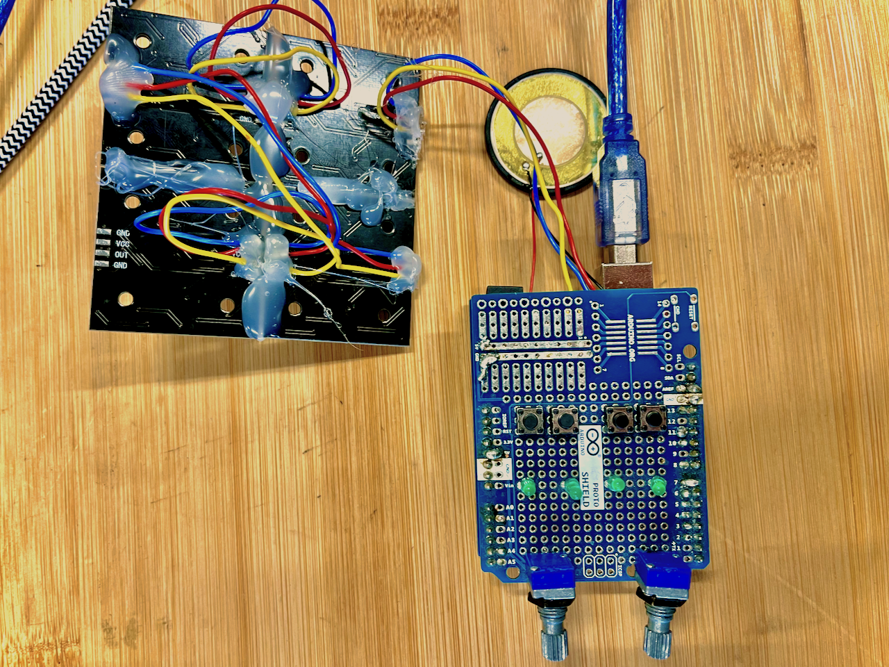

**A project for the workshop Prototyping the Future: Embedded Programming @ Roskilde University spring 2024**

*A simple handheld console that I would let my son Vincent play. Without any distractions but a bunch of abstractions to strengthen his imagination with a emphasis on experimentation.*

Examples of games you can play with a 100 pixel "screen".

**THE CONCEPT**
- A programmable console for Vincent
    - Board
        - Arduino Uno
    - Outputs
        - 10*10 LED RGB matrix instead of a screen
        - Simple piezo buzzer as a speaker
        - 4 status LEDs
    - Inputs
        - 2 Rotary encoders
        - 4 digital buttons
    - Game ideas
        - Tic tac toe
        - Battleship
        - Digital dice rolls
        - Adventure game
        - Tetris
        - Pong
        - Game of Life
        - Brick Break

**THE WORKING PROTOTYPE**

  
nick lee jerlung 2024